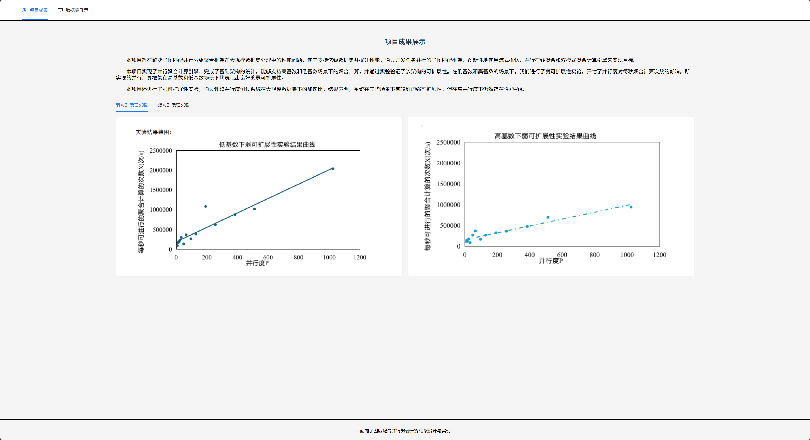

## 1. 软件设计实现
- **技术栈选择**：
  - 前端框架：Vue 3（Composition API）
  - 构建工具：Vite（快速开发体验）
  - UI组件库：Ant Design Vue
  - 类型检查：TypeScript
  - 路由管理：Vue Router

- **项目结构**：
```plaintext
/
├── src/
│   ├── assets/          // 静态资源
│   ├── components/      // 通用组件
│   ├── views/           // 页面组件
│   ├── router/          // 路由配置
│   ├── utils/           // 工具函数
│   └── App.vue          // 根组件
├── public/              // 公共资源
├── vite.config.ts       // Vite配置
├── tsconfig.json        // TypeScript配置
└── package.json         // 项目依赖
```

## 2. 用户界面
### 数据可视化方案
  - 使用ECharts实现交互式图表
  - 实验曲线图引用示例：
    ```html
    <experiment-chart 
        :data="w2Data"
        img-src="public/images/W2-高基数聚合模式的强可扩展性实验结果曲线.png"
    />
    ```
  - 采用Ant Design Vue组件库构建界面
  - 使用Vue 3的Composition API组织代码逻辑
  - 实现响应式布局，适配不同设备
  - 使用Vite的热更新功能，提升开发效率

首页


数据集展示页面


### 核心算法实现
#### 动态分桶算法
**基数自适应机制**
```typescript
// 取自ResultsView.vue的分桶逻辑
const dynamicBucketing = (data: number[], maxBuckets: number) => {
    // 自适应调整逻辑，保证分桶效率
    const min = Math.min(...data);
    const max = Math.max(...data);
    let bucketSize = Math.ceil((max - min) / maxBuckets);
    // ...
};
```

## 3. 数据来源
### 类型校验方案
  - 扩展Ant Design Table列类型定义
  - 本地CSV/Excel文件上传
  - 使用`xlsx`库解析文件数据
  - 使用`papaparse`处理CSV文件

## 4. 改进过程
- **增量改进**：
  1. 添加TypeScript支持，增强代码可维护性
  2. 使用Vite替换Webpack，提升构建速度
  3. 引入`unplugin-vue-components`实现组件自动导入
  4. 优化数据解析性能，支持大文件处理

- **遇到的困难及解决方案**：
  1. **大文件处理性能问题**：
     - 问题：处理大文件时页面卡顿
     - 解决方案：使用Web Worker进行后台处理
  2. **TypeScript类型定义复杂**：
     - 问题：第三方库类型定义不完善
     - 解决方案：自定义类型声明文件
  3. **组件库样式冲突**：
     - 问题：Ant Design Vue样式与其他库冲突
     - 解决方案：使用CSS Scope和深度选择器

## 5. 系统部署
- **安装项目依赖**：
  ```bash
  pnpm install
  ```
- **开发环境**：
  ```bash
  pnpm run dev
  ```
- **生产环境构建**：
  ```bash
  pnpm run build
  ```
- **部署方式**：
   项目使用Nginx部署静态资源到服务器。
   
   Nginx配置：
   ```nginx
   server
    {
        listen 80;
        #根据子域名匹配项目
        server_name ~^(?<client>.+)<domain>$; # <domain>替换为真实域名，注意"."的转义

        location / {
            root /www/wwwroot/$client/dist/; # 项目生产环境的dist目录
            index index.html;
            try_files $uri $uri/ /index.html;
        }
    }
    ```

## 6. 性能优化
- 使用Vite的代码分割功能
- 按需加载Ant Design Vue组件
- 使用Tree Shaking移除未使用代码

通过以上技术方案，我们构建了一个高效、可维护的前端项目，能够满足复杂业务需求，同时保证了良好的开发体验和系统性能。